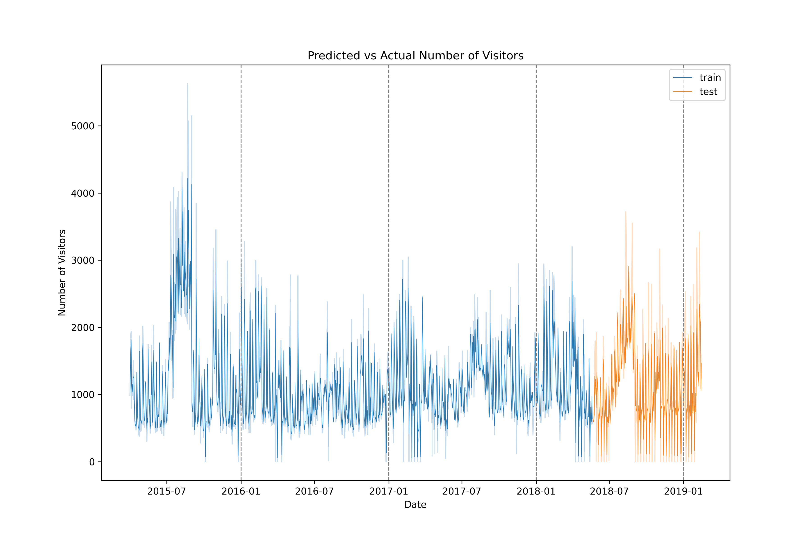
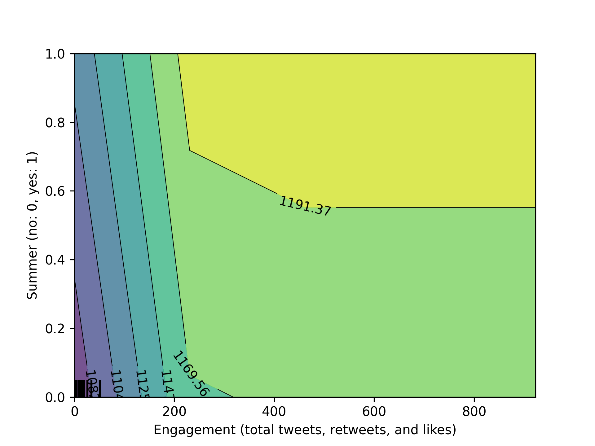

# Sentiment analysis and museums

## Table of contents

- [Summary](#summary)
- [Data sources](#data-sources)
- [Feature engineering](#feature-engineering)
- [Challenges with the data](#challenges-with-the-data)
- [Twitter scraping and analysis](#twitter-scraping-and-analysis)
- [Modeling visitor rates](#modeling-visitor-rates)
- [Drawing insights from the model](#drawing-insights-from-the-model)
    - [Rain, rain, don't go away?](#rain-rain-dont-go-away)
    - [What makes a good day at the museum?](#what-makes-a-good-day-at-the-museum)
- [Future directions](#future-directions)
- [Author](#author)

## Summary
This project looks at visitor data and social media timelines to predict changes in visitors. On average, there were 1125 visitors per day from Apr 2015 - Feb 2019, the temporal extent of the dataset. The greatest number of visitors came to the museum in 2018 (416k) and the fewest came in 2016 (346k). Based on a random forest regression model, I would make the following recommendations:

1. To capitalize on potential revenue from high visitor volumes (e.g., gift shop sales, food, special exhibit tickets), it would make sense to plan exhibition openings and special events, discounted food days, etc. when summer peak temperatures are expected to be high (above 28 ºC)

2. Although it isn't surprising that museum closing strongly predicts visitor numbers, to maximize visitor volume, it would make sense to close the museum more frequently in the spring when minimum daily temperatures are low and overall visitor numbers are down with kids back in school

3. The number of tweets put out by the Bristol Museum had little effect on visitors, and there was a flatline after 5-10 tweets per day, suggesting that this would be an optimal number going forward to optimize time budgets (of social media staff, etc)

Above is a plot showing changes in the number of visitors over time. The drops to zero that become more common in 2018-2019 are cases where the museum is closed (more on that later). 

## Data sources
- Museum visitor data obtained from the Bristol Museum 
- Tweets containing "Bristol Museum" (see data/processed folder)
- Weather data downloaded using `meteostat`

## Feature engineering
- Lag (daily, weekly): I used the `shift` function to obtain daily (shift 1) and weekly lags (shift 7). This was to account for the effect of previous day or week numbers on the current days' visitors
- Weekends: determined whether the day was a Saturday or Sunday
- Day of the week: self-explanatory
- Climate (max/min daily temperature, precipitation, windspeed): obtained from meteostat, imputed missing values based on average multivariate trends among variables
- Exhibit: extracted time ranges of exhibits from the Bristol website
- Promotion: total daily number of tweets put out by the museum
- Sentiment: average daily sentiment of tweets by non-museum twitter accounts
- Engagement: total daily number of tweets, retweets, and likes by non-museum accounts
- Season: Winter (December-February), Spring (March-May), Summer (June-August), Autumn (September-November)

## Challenges with the data
I filtered out website links and common words not useful in calculating sentiment from tweets. In many cases, tweets with negative sentiment had the word "death" in them. Most of these tweets were actually positive and related to the Death exhibit in 2015. To fix this, I added "death" to the list of stop words prior to sentiment analysis with `TextBlob`. 

Some of the days hade missing weather data. I got around this challenge by using data imputation methods implemented in the `sklearn` module (see Jupyter notebook for details).

Several drops in visitor numbers were due to the musem being closed. This allowed me to create a categorical variable (closed or open) by determining whether visitor numbers were zero for a given day.

One potential problem with predicting future visitor numbers is that my model might only be relevant for a given year (or set of years). To rule this out, I fit a random forest regression model with year as a predictor and found that this variable was insignificant (all importance values < 0.03) in explaining variation in visitor numbers among years. This increased my confidence that the model is relevant for current (and future) visitor numbers at the Bristol Museum.

## Twitter scraping and analysis
The new X API is prohibitively expensive, therefore I used [Selenium](https://github.com/godkingjay/selenium-twitter-scraper) to scrape tweets from twitter between 2015 and 2019 (see `scraping_brisol.py` and `scraper/` for code used). In total, I obtained __6281__ tweets from 2015 - 2019. Of those, __3133__ were put out by the museum and __3148__ were tweeted by other twitter handles.

To understand the importance of public perception on museum visitor rates, I calculated three metrics:

1. Promotion - the number of museum tweets
2. Engagement - the number of user tweets, retweets, and likes
3. Sentiment - the average sentiment value of user tweets

To calculate sentiment, I used the `TextBlob` in python to predict sentiment from the content of user tweets between 2015-2019. Below is a wordcloud (generated with the `wordcloud` module in python).

I averaged twitter sentiments by day and then plotted over time. You can see these data plotted below. There is a really big spike at the beginning of 2018 that corresponds to some negative press the Bristol Museum had over an apparent dispute of the display of a Banksy piece (see news article [here](https://www.bbc.com/news/uk-england-bristol-42708000)).

## Modeling visitor rates
I used random forest regression models implemented in the `sklearn` python module. The best model fit the training data well, with an $R^2$ score of 0.91 (see blue line in the plot below). The model also predicted test data well, with $R^2$ = 0.74. The mean absolute error (MAE) of the test predictions was 253, indicating that the model accurately predicts daily museums numbers to within ~250 visitors per day. You can see in the plot below that the model (dark line) is doing a pretty good job at tracking the actual number of daily visitors over time (faded line). The large jump in July 2015 corresponds to the opening of the _Art Forms in Nature_ exhibit. Compared to other exhibition openings, this one was more profitable, possibly because it opened in the summer when temperatures were high and kids were out of school.

## Drawing insights from the model
The top-5 most important features that predict visitor numbers are: daily lag (importance score = 0.26), weekly lag (0.19), Saturdays (0.09), weekeneds (0.06), and maximum temperature (0.05). The weekend effect makes sense since kids are out of school, adults are not working, and people are probably just more interested in doing things on the weekend. It is interesting to see that weekend interacts with exhibit displays, as exhibits also had a substantial effect, attracing around 100 visitors per day over the average.

Maximum daily temperature showed an overall negative effect on visitors, but this effect was somewhat conditional on the time of week. For example, on weekends, maximum temperatures doesn't really have any effect on visitor rates, but on weekdays there is a more pronounced effect, with about 200 fewer visitors per day.

Twitter engagement predicted museum visitor numbers more strongly in the summer months, as seen below.

### Rain, rain, don't go away?
It is interesting to look at the ineracting effects between precipitation and windspeed. The partial dependence plot shown below suggest that around 150 more people come to the museum on windy, rainy days than on calm, dry days. This makes sense if people are looking to get out of the elements. The museum can capitalize on this effect by potentially offering discounts for exhibits and food on those days to capitalize on the increased number of visitors.

### What makes a good day at the museum?
Another way to look at the data is with waterfall chart, commonly used in the financial sector. Below is a waterfall chart for the day with the greatest number of visitors (August 22, 2015). The features are ordered by their effect on the baseline (0). We see that weekly (7-day) lag has the greatest effect (resulting in 856 more visitors compared to the average). The second most important predictor is maximum temperature. This makes sense if people are out in the parks and want to escape from the heat into an air-conditioned space (the maximum tempeterature that day was 27.8 ºC, or 82 ºF). It's also interesting to see that there was net positive sentiment on twitter that day that also contributed to ~100 more visitors. The ongoing special exhibit "Death: The Human Experience" attracted another 140 visitors. The net effect of all predictors was 3112 more visitors than the average baseline of 1127 visitors.

## Future directions
- Test this model with visitor data from other large museums
- Incorporate more features into the model
- Optimize the sentiment analysis as it was missing many cases (e.g., the Death exhibit often yielded negative sentiments although the exhibit received high praise and resulted in a jump in visitor rates).
- Forecast overall revenue by calculating the area under the curve based on weather predictions and historic date. Assuming a visitor purchases on average $20 USD in food and $12 USD in special exhibit tickets, and accounting for historical and future fluctuations in climate, I could predict total revenues for 2025 based on my model.

<!-- maybe 1/10 people buy a ticket?? -->

## Author
Chad M. Eliason  
Field Museum
