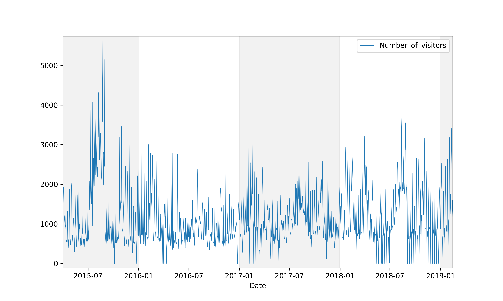
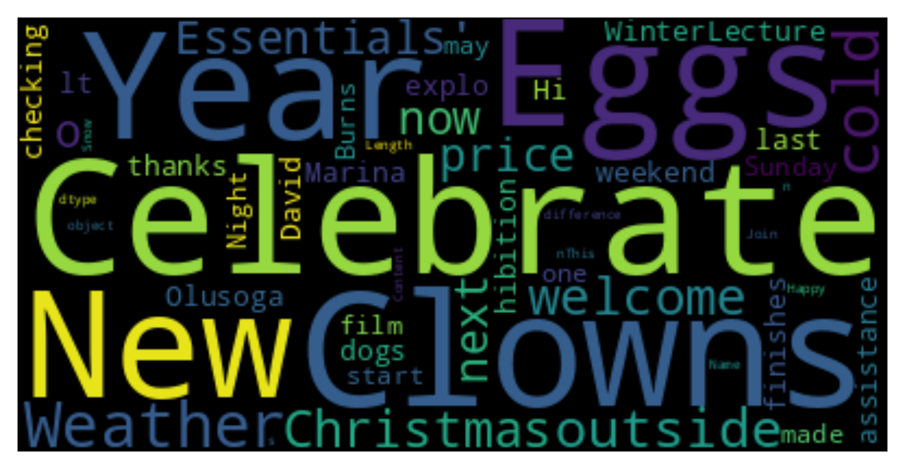
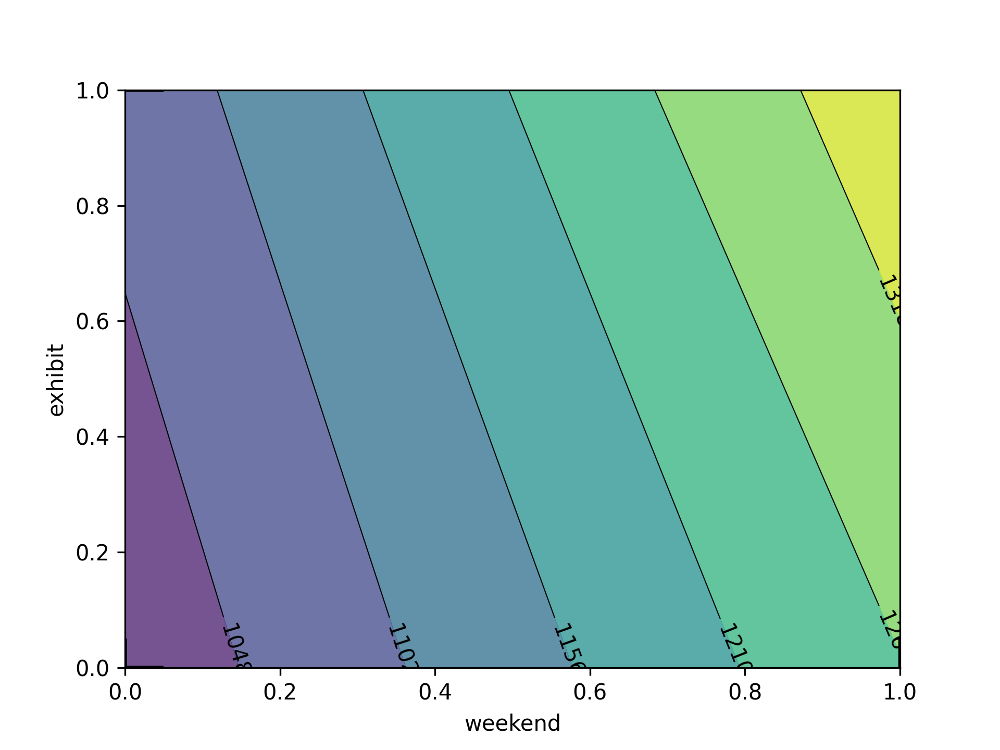
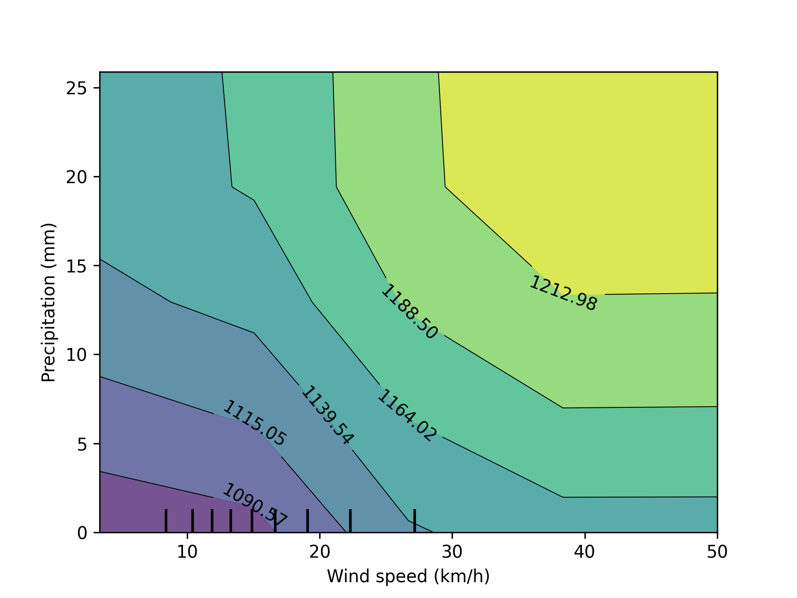
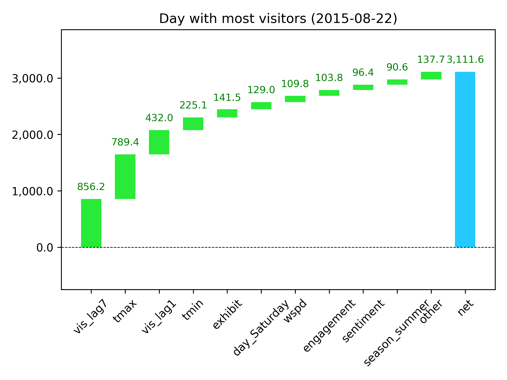

# Sentiment analysis and museums

## Data sets

- Museum visitor data obtained from the Bristol Museum 
- Tweets containing "Bristol Museum" (see data/processed folder)
- Weather data downloaded using `meteostat`

## Overview

This project looks at visitor data and social media timelines to predict lags/changes in visitor rates. Below is a figure showing changes in visitor rates over time. The drops to zero that become more common in 2018-2019 are cases where the museum is closed. I later used this feature to extract a ``closed`` variable for predicting visitors. On average, there were 1125 visitors per day from 2015 - 2019.

## Twitter results

The new X twitter API is prohibitively expensive, therefore I used [Selenium](https://github.com/godkingjay/selenium-twitter-scraper) to scrape tweets from twitter between 2015 and 2019 (see `scraping_brisol.py` and `scraper/` for code used). In total, I obtained __6281__ tweets from 2015 - 2019. Of those, __3133__ were put out by the museum and __3148__ were tweeted by other twitter handles.

To understand the importance of public perception on museum visitor rates, I calculated three metrics:

1. Promotion - the number of museum tweets
2. Engagement - the number of user tweets, retweets, and likes
3. Sentiment - the average sentiment value of user tweets

To calculate sentiment, I used the `TextBlob` in python to predict sentiment from the content of user tweets between 2015-2019. Below is a wordcloud (generated with the `wordcloud` module in python).

I averaged twitter sentiments by day and then plotted over time. You can see these data plotted below. There is a really big spike at the beginning of 2018 that corresponds to some negative press the Bristol Museum had over an apparent dispute of the display of a Banksy piece.

## Challenges with the data

Filtered out website links and common words not useful in calculating sentiment. In many cases, tweets with negative sentiment had the word "death" in them. Most of these tweets were actually positive and related to the Death exhibit in 2015. To fix this, I added "death" to the list of stop words prior to sentiment analysis with `TextBlob`. 

Some of the days hade missing weather data. I got around this challenge by using data imputation methods implemented in the `sklearn` module (see Jupyter notebook for details).

Several drops in visitor rates were due to the musem being closed. This allowed me to create a categorical variable (closed or open) by determining whether visitor numbers were zero for a given day.

One potential problem with predicting future visitor numbers with my model is that the model might only be relevant for a given year (or set of years). To rule this out, I fit a random forest regression model with year as a predictor and found that this variable was insignificant (all importance values < 0.03) in explaining variation in visitor numbers among years. This increased my confidence that the model is relevant for current (and future) visitor numbers at the Bristol Museum.

## Modeling visitor rates

I used random forest regression models implemented in the `sklearn` python module. The best model had an accuracy ($R^2$) of 87%, which is pretty good. You can see in the figure below that the model (red dashed line) is doing a pretty good job at predicting changes in the actual number of daily visitors over time (blue line).

**Figure 1:** Actual and predicted number of visitors to the Bristol Museum from 2015-2019.

Using the random forest model, I found that the top 3 most important features that predict visitor numbers are WEEKEND (0.20 importance), maximum temperature TMAX (0.11), and whether there is a new EXHIBIT on display (0.11).

The most important feature that predicts visitor numbers is WEEKEND, with about 700 more visitors per day. This makes sense given that kids are out of school, adults are not working, and people are just more interested in doing things on the weekend.

EXHIBIT had a large effect too, attracing around 400 more visitors per day.

TMAX showed an overall negative effect on visitors, but this effect was conditional on the time of week, among other factors. For example, on weekends, TMAX doesn't really have any effect on visitor rates, but on weekdays there is a more pronounced effect with about 200 fewer visitors per day.

The large jump in July 2015 corresponds to the opening of the Art Forms in Nature exhibit (LINK). Compared to other exhibition openings, this one was more profitable, possibly because it opened in the summer when TMAX was high and school as off.

<!--  -->

It is interesting to look at the ineracting effects between precipitation (0.066) and windspeed (0.070 importance scores). The partial dependence plot shown below suggest that about 142 more people come to the museum on calm and rainy days than on windy dry days.

## What makes a good day at the museum?

Another way to look at the data is with waterfall charts. These are commonly used in the financial sector.

Below is a waterfall chart for the day with the greatest number of visitors (August 22, 2015). The features are ordered by their effect on the baseline (0). We see that TMAX has the greatest effect (resulting in 1153.9 more visitors compared to the average). This makes sense if people are out and want to get out of the heat and into an air-conditioned space (the maximum tempeterature that day was 27.8 C or 82 F). It's also interesting to see that there was net positive sentiment on twitter that day that also contributed to ~66 more visitors.

The ongoing special exhibit "Death: The Human Experience" attracted another 536 visitors, and the fact that this day was a weekend brought in 528 more than average. The net effect of all the predictors was 2840.1 more visitors than baseline of 1127 visitors.

## Insights

- To capitalize on potential revenue from high visitor volumes, it would make sense to plan exhibition openings and special events, discount food days etc. when summer peak temperatures are expected to be high (TMAX >28 C).

- Although it is of course not surprising that museum closing was a strong predictor of visitor numbers in the model, to maximize visitor volume, it would make sense to close the museum more frequently in the spring then TMIN is low (TMIN had a 0.08 importance rating) and overall visitor numbers are decreased with kids back in school.

- The number of tweets put out by the Bristol Museum had little effect on visitors (0.03 importance score), and there was a flatline after 5-10 tweets per day, suggesting that this would be an optimal number going forward to optimize time budgets (of social media staff, etc).

- We can forecast overall revenue by calculating the area under the curve based on weather predictions and historic date. Assuming a visitor purchases on average $20 USD in food and $12 USD in special exhibit tickets, I predict $XX total revenue for 2025 based on my model.

maybe 1/10 people buy a ticket??

## Future directions

I can test this model with visitor data from other large museums

Incorporate more features into the model

Optimize the sentiment analysis as it was missing many cases (e.g., the Death exhibit often yielded negative sentiments although the exhibit received high praise and resulted in a jump in visitor rates).

## Author

Chad M. Eliason  
Field Museum
