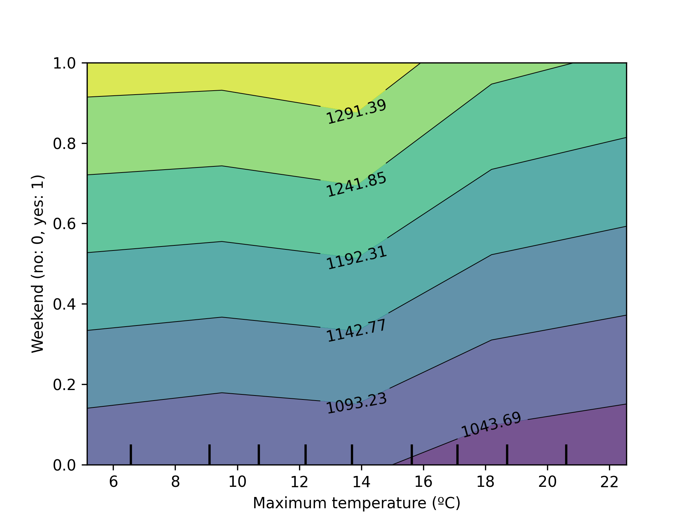

# Sentiment analysis and museums

## Overview

This project looks at visitor data and social media timelines to predict lags/changes in visitor rates. Below is a figure showing changes in visitor rates over time. The drops to zero that become more common in 2018-2019 are cases where the museum is closed. I later used this feature to extract a ``closed`` variable for predicting visitors.

## Data sets

- Museum visitor data obtained from the Bristol Museum 
- Tweets containing "Bristol Museum" (see data/processed folder)

## Solutions to tricky problems

Closed dates - when visitors = 0 assume closed

Weather data had some NAs that I got around by using data imputation methods implemented in the `sklearn` module.

The new X twitter API is prohibitively expensive, therefore I used [Selenium](https://github.com/godkingjay/selenium-twitter-scraper)

Filtered out website links and common words not useful in calculating sentiment. Had to add "death" and "dead" to account for Death exhibit. 

I calculated three social media metrics: engagements (likes + tweets + retweets), promotion (number of tweets put out by the Bristol Muuseum account), and sentiment (average sentiment value using a tokenized approach to tweet content)

## Results

Using `TextBlob` in python, I also ran a model that predicted sentiment from the content of tweets from 2015-2019 (see code for scraping from X). Below is a wordcloud (generated with `wordcloud` module).

I averaged twitter sentiments by day and then plotted over time. You can see these data plotted below. There is a really big spike at the beginning of 2018 that corresponds to some negative press the Bristol Museum had from a Banksy piece being displayed.

I used random forest regression models implemented in the `sklearn` python module. The best model had an accuracy ($R^2$) of 87%, which is pretty good. You can see in the figure below that the model (red dashed line) is doing a pretty good job at predicting changes in the actual number of daily visitors over time (blue line).

**Figure 1:** Actual and predicted number of visitors to the Bristol Museum from 2015-2019.

## Insights

Using the random forest model, I found that the top 3 most important features that predict visitor numbers are WEEKEND (0.20 importance), maximum temperature TMAX (0.11), and whether there is a new EXHIBITS on display (0.11).

The most important feature that predicts visitor numbers is WEEKEND, with about 700 more visitors per day. This makes sense given that kids are out of school, adults are not working, and people are just more interested in doing things on the weekend.

EXHIBITS had a large effect too, with around 400 more visitors on a given day.

TMAX showed an overall negative effect on visitors, but this effect was conditional on the time of week, among other factors. For example, on weekends, TMAX doesn't really have any effect on visitor rates, but on weekdays there is a more pronounced effect with about 200 fewer visitors per day.

The large jump in July 2015 corresponds to the opening of the Art Forms in Nature exhibit (LINK). Compared to other exhibition openings, this one was more profitable, possibly because it opened in the summer when TMAX was high and school as off.

<!--  -->

## Recommendations

Assuming an average ticket cost of $xx, we can make predictions for the future:

- To maximize profit, it would make sense to close the museum more frequently in the winter then TMIN is low (TMIN had a 0.08 important rating).

- The number of tweets put out by the Bristol Museum had little effect on visitors (0.03 importance score), and there was a flatline after 5-10 tweets per day, suggesting that this would be an optimal number going forward to optimize time budgets (of social media staff, etc).

- We can forecast overall revenue by calculating the area under the curve based on weather predictions and historic date. I predict $XX total revenue for 2025 based on my model.

## Future directions

Test this model with other museums

Incorporate more features into the model

Optimize the sentiment analysis as it was missing many cases (e.g., the Death exhibit often yielded negative sentiments although the exhibit received high praise and resulted in a jump in visitor rates).

## Author

Chad M. Eliason  
Field Museum
